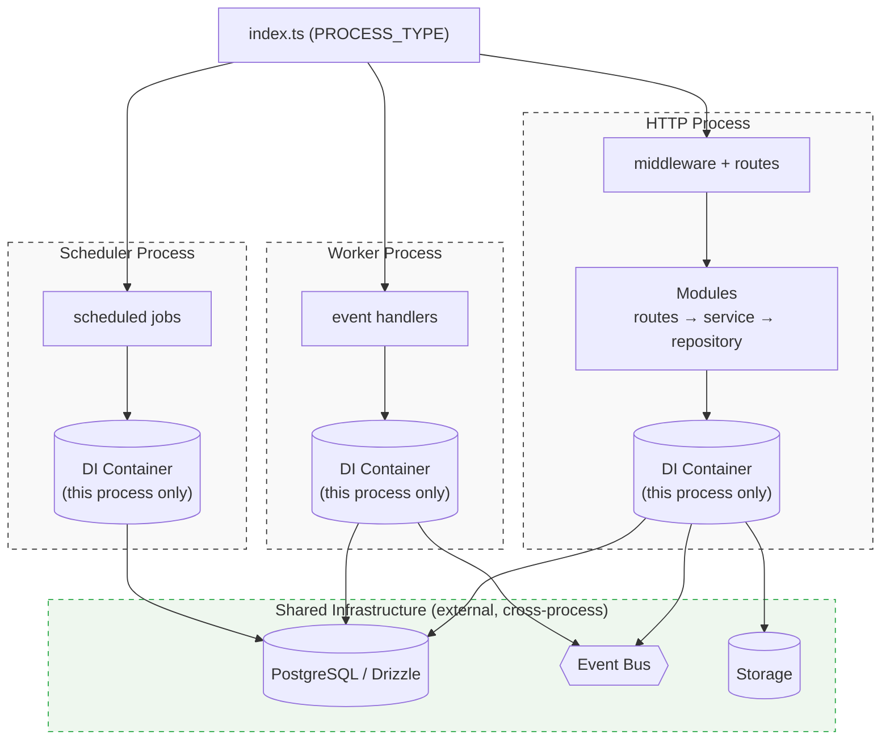

# Jet V0.2.1

[](./LICENSE)

A modular TypeScript backend framework built on [Hono](https://hono.dev), with PostgreSQL, Drizzle ORM, and built-in event-driven architecture.

## Tech Stack

- **Runtime**: Node.js + TypeScript
- **Web Framework**: Hono
- **Database**: PostgreSQL + Drizzle ORM
- **Auth**: JWT + RBAC(Fire Shield)
- **Validation**: Valibot
- **Event Bus**: In-memory or pg-boss or bullMQ
- **DI Container**: treasure-chest

## Getting Started

### Overview



> Each process type has its own in-memory DI container (`AppRegistry.rootContainer` —
> `src/shared/registry.ts`) — nothing shares it across processes. What's actually shared when
> `PROCESS_TYPE=http|worker|scheduler` run as separate deployments (PM2/Docker/K8s, see
> [Multi-Process Mode](#multi-process-mode) below) is the external infra: PostgreSQL and, once a
> real transport (`pg-boss`/`bullMQ`) replaces the in-memory Event Bus, the queue itself. See
> `docs/apply/architecture.md` / `docs/deeper/architecture.md` for the full request flow and
> bootstrap sequence.

### Starting a New Project from Jet

The steps below (`npm install`, `npm run dev`, ...) assume you already have this repo checked
out to work on Jet itself. To start **your own app** on top of Jet instead — pulling a specific
tagged version off GitHub Releases rather than cloning `main` — see
[`docs/apply/getting-started.md`](docs/apply/getting-started.md). Quick version:

```bash
npx degit khapu2906/jet#v0.1.11 my-app   # swap the tag for the latest at
cd my-app                                # https://github.com/khapu2906/jet/releases
```

### Prerequisites

- Node.js 20+
- npm
- PostgreSQL (or Docker)

### Setup

```bash
# Install dependencies
npm install

# Copy environment config
cp .env.example .env

# Start PostgreSQL via Docker
docker compose up -d

# Create database
npm run db:setup

# Run migrations
npm run db:migrate

# Start dev server
npm run dev
```

Server runs on `http://localhost:2906` by default.

## Scripts

### Development

| Command | Description |
|---|---|
| `npm dev` | Start dev server with hot reload |
| `npm build` | Compile TypeScript to `dist/` |
| `npm start` | Run compiled output |
| `npm serve` | Build + start |
| `npm typecheck` | Type check without emitting |
| `npm lint` | Run ESLint |
| `npm lint:fix` | Auto-fix lint issues |
| `npm arch:check` | Enforce module/layer boundaries with [ArchSafe](https://archsafe.vercel.app/) (`archsafe.config.mts`) |
| `npm arch:baseline` | Snapshot current architecture violations to adopt ArchSafe gradually |
| `npm docs:dev` | Serve `docs/` locally as a browsable Docsify site |
| `npm make:http -- <name>` | Scaffold a new HTTP module from `stubs/http-module/` |
| `npm make:worker -- <name>` | Scaffold a new worker module from `stubs/worker-module/` |
| `npm make:scheduler -- <name>` | Scaffold a new scheduler module from `stubs/scheduler-module/` |

### Database

| Command | Description |
|---|---|
| `npm db:setup` | Create database if not exists |
| `npm db:generate` | Generate migration files from schema |
| `npm db:migrate` | Apply pending migrations |
| `npm db:push` | Push schema directly (no migration) |
| `npm db:status` | Check tables and migration status |
| `npm db:reset` | Drop all tables and types |
| `npm db:check` | Validate migration files |
| `npm db:test` | Test database connection |

## Project Structure

```
src/
├── index.ts                   # Entry point: selects process type
├── processes/
│   ├── http.ts                # HTTP API server process
│   ├── worker.ts             # Background job worker process
│   └── scheduler.ts          # Scheduled job process
│
├── modules/
│   ├── auth/                 # Authentication module
│   ├── demo-scheduler/      # Scheduler-based demo jobs
│   └── system/              # Health check / system utilities
│
└── shared/
    ├── base/
    │   ├── modules.ts        # Base Module abstraction
    │   └── processes.ts      # BaseProcess + Runner abstraction
    │
    ├── registry.ts          # AppRegistry — root container + module instance registry
    ├── auth/                # JWT, RBAC, auth middleware
    ├── config/              # Environment configuration
    ├── db/                  # Drizzle ORM instance + schema
    ├── doc/                 # API documentation (Swagger/OpenAPI)
    ├── dto/                 # Shared DTO definitions
    ├── event-manager/       # Event bus abstraction
    ├── middleware/          # Global middleware stack
    ├── errors/              # Error types + handlers
    ├── logger/              # Logging system
    ├── storage/             # Storage abstraction layer
    ├── scheduler/           # Scheduler abstraction layer
    └── utils/               # Shared utilities
```

## Environment Variables

See `.env.example` for all available options.

Key variables:

```env
# ============================================================================
# App
# ============================================================================
APP_NAME="Jet Framework"
APP_VERSION="1.0.0"

# ============================================================================
# PROCESS
# ============================================================================
NODE_ENV=development
PROCESS_TYPE=*  # http | worker | scheduler | * - for all
PORT=2906

# ============================================================================
# LOGGING / OBSERVABILITY
# ============================================================================
LOG_LEVEL=debug  # debug | info | warn | error

EVENT_BUS_TYPE=memory  # memory | pgboss | bullmq
EVENT_BUS_DEBUG=true

# ============================================================================
# SECURITY CONFIGURATION
# ============================================================================
# JWT Authentication
JWT_SECRET=change-me-in-production
JWT_EXPIRES_IN=1h
JWT_REFRESH_EXPIRES_IN=7d

# CORS Configuration
# SECURITY: Never use wildcard (*) in production with credentials
# Specify exact frontend URLs separated by commas
# Example: CORS_ORIGINS=https://app.yourdomain.com,https://www.yourdomain.com
CORS_ORIGINS=http://localhost:3000,http://localhost:3001

# Rate Limiting
RATE_LIMIT_ENABLED=true
RATE_LIMIT_MAX=100
RATE_LIMIT_WINDOW=15m

# ============================================================================
# LOGGING
# ============================================================================
# Logging
LOG_LEVEL=info  # Options: debug, info, warn, error
LOG_TYPE=pretty

# ============================================================================
# DATABASE CONFIGURATION
# ============================================================================
# SECURITY: In production, always use strong passwords and enable SSL
DB_HOST=localhost
DB_PORT=5432
DB_USER=postgres
DB_PASSWORD=postgres  # CHANGE THIS IN PRODUCTION
DB_NAME=jet-db

# Database SSL Configuration (Production)
# Enable SSL for encrypted database connections in production
DB_SSL=false  # Set to 'true' in production
DB_SSL_REJECT_UNAUTHORIZED=true  # Verify SSL certificates
# DB_SSL_CA=path/to/ca-certificate.crt  # Optional: CA certificate path

# ============================================================================
# STORAGE
# ============================================================================
STORAGE_PROVIDER="local"
STORAGE_LOCAL_DIR=".tmp/storage"
STORAGE_LOCAL_BASE_URL=http://localhost:2906/storage
STORAGE_LOCAL_SECRET="change-me-in-production"
```

## Multi-Process Mode

The app can run as an API server or background worker:

```env
PROCESS_TYPE=http       # default — HTTP server
PROCESS_TYPE=worker     # background job processor
PROCESS_TYPE=scheduler  #Scheduled job trigger service
```

To scale workers, run multiple `PROCESS_TYPE=worker` instances via PM2, Docker Compose, or Kubernetes. PgBoss distributes jobs across all instances without duplication.

## API Docs

In development mode, Swagger UI is available at:

```
http://localhost:2906/docs
```

## Documentation

Docs are split into `apply/` (how to, with copy-pasteable code) and `deeper/` (why, internal
mechanics/rationale):

| Topic | Apply | Deeper |
|---|---|---|
| Getting Started (new project) | [docs/apply/getting-started.md](docs/apply/getting-started.md) | — |
| Architecture | [docs/apply/architecture.md](docs/apply/architecture.md) | [docs/deeper/architecture.md](docs/deeper/architecture.md) |
| Modules | [docs/apply/modules.md](docs/apply/modules.md) | [docs/deeper/modules.md](docs/deeper/modules.md) |
| Auth | [docs/apply/auth.md](docs/apply/auth.md) | [docs/deeper/auth.md](docs/deeper/auth.md) |
| HTTP | [docs/apply/http.md](docs/apply/http.md) | [docs/deeper/http.md](docs/deeper/http.md) |
| Middleware | [docs/apply/middleware.md](docs/apply/middleware.md) | [docs/deeper/middleware.md](docs/deeper/middleware.md) |
| Worker | [docs/apply/worker.md](docs/apply/worker.md) | [docs/deeper/worker.md](docs/deeper/worker.md) |
| Scheduler | [docs/apply/scheduler.md](docs/apply/scheduler.md) | [docs/deeper/scheduler.md](docs/deeper/scheduler.md) |
| ArchSafe (architecture enforcement) | [docs/apply/archsafe.md](docs/apply/archsafe.md) | [docs/deeper/archsafe.md](docs/deeper/archsafe.md) |
| Responses | [docs/apply/responses.md](docs/apply/responses.md) | — |
| Database | [docs/apply/database.md](docs/apply/database.md) | — |
| Config | [docs/apply/config.md](docs/apply/config.md) | — |

For AI agents/code-pattern reference, see `docs/llm/code-pattern.md` and `CLAUDE.md`.
