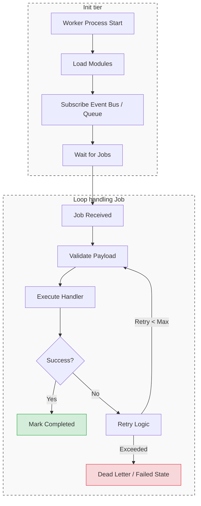
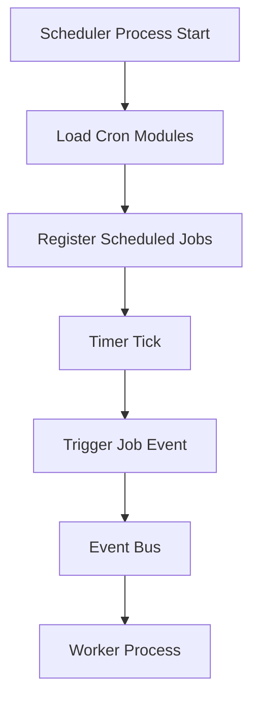

# Architecture Overview

## Multi-Process Design

The application supports three process types, controlled by the `PROCESS_TYPE` environment variable:

```
PROCESS_TYPE=api         # HTTP API server (default)
PROCESS_TYPE=worker      # Background job consumer
PROCESS_TYPE=scheduler   # Scheduled job trigger service
```

All processes share the same module system and dependency injection container, but initialize different runtime infrastructure depending on their role.

---

## Worker Scaling

To scale background processing, run multiple `worker` instances. Jobs are distributed across all workers to ensure horizontal scalability.

```yaml
worker:
  environment:
    PROCESS_TYPE: worker
  deploy:
    replicas: 4
```

> Note: Job distribution behavior depends on the underlying queue system (e.g. PgBoss / Redis queue). Ensure your job system supports concurrency and deduplication.

---

## Application Lifecycle

```
index.ts
  └─ PROCESS_TYPE → ApiProcess | WorkerProcess | SchedulerProcess
        └─ BaseProcess
              1. _registerCoreDependencies()   ← DB, EventBus
              2. _initModules()                ← register() + onInit()
              3. bootstrap()                   ← start server / start consumer / start scheduler
              4. SIGTERM / SIGINT → cleanup()  ← graceful shutdown
```

Each process type is responsible for only one concern:

* API → request handling
* Worker → job execution
* Scheduler → job triggering

---

## Module System

Each feature is encapsulated in a `Module` class:

```ts
class AuthModule extends Module {
  register()    // bind services into DI container
  bootstrap()   // start runtime logic (HTTP routes, consumers, etc.)
  onDestroy()   // cleanup resources
}
```

Modules declare dependencies via `getImportModules()`. The framework resolves them automatically using a hierarchical container model (parent → child containers).

---

## Dependency Injection

The system uses the `treasure-chest` DI container. Services are registered using symbol-based keys:

```ts
container.bind(AuthServiceKey).to(AuthService)
```

Each module has its own child container inheriting from the root container, enabling:

* Shared global services (DB, logger, event bus)
* Isolated module boundaries
* Cross-module resolution when needed

---

## Request Flow (API Process)

```
HTTP Request
  → Request ID middleware
  → CORS
  → Security headers
  → CSP
  → Logging
  → Rate limiting
  → Route handler
      → Validation middleware
      → Controller
          → Service layer
              → Domain logic / Job dispatch / Events
      → Response
  → Error handler (if exception occurs)
```

---

## 🔄 System Flow (End-to-End Architecture)

### API Request Flow

```mermaid
flowchart TD
    %% Nodes Definition
    A[Client Request] --> B[API Process]
    B --> C
    
    %% Middleware Subgraph
    ≈[Middleware Stack]
        direction TB
        C1[Request ID] --> C2[CORS]
        C2 --> C3[Security Headers]
        C3 --> C4[Logging]
        C4 --> C5[Rate Limiter]
    end

    C5 --> D[Router]
    D --> E[Controller]
    E --> F[Service Layer]
    F --> G[Domain Logic]

    %% Business & Side Effects
    G --> H{Side Effects?}
    H -->|DB| I[(Database)]
    H -->|Event| J[Event Bus]
    H -->|Job| K[Queue / Worker]

    J --> L[Worker Process]
    K --> L

    %% Response Flow
    E --> M[HTTP Response]

    %% Styling 
    style C fill:#f9f9f9,stroke:#333,stroke-width:1px,stroke-dasharray: 5 5
    style M fill:#d4edda,stroke:#28a745,stroke-width:2px
    style A fill:#cce5ff,stroke:#004085,stroke-width:2px
```

---

### Worker Execution Flow



---

### Scheduler Flow



---

## Directory Layout

```
src/
├── index.ts                   # Entry point: selects process type
├── processes/
│   ├── http.ts                # HTTP API server process
│   ├── worker.ts             # Background job worker process
│   └── scheduler.ts          # Scheduled job process
│
├── modules/
│   ├── auth/                 # Authentication module
│   ├── user-scheduler/      # Scheduler-based user jobs
│   └── system/              # Health check / system utilities
│
└── shared/
    ├── base/
    │   ├── modules.ts        # Base Module abstraction
    │   └── processes.ts      # BaseProcess + Runner abstraction
    │
    ├── factory.ts           # AppFactory / container bootstrap
    ├── auth/                # JWT, RBAC, auth middleware
    ├── config/              # Environment configuration
    ├── db/                  # Drizzle ORM instance + schema
    ├── doc/                 # API documentation (Swagger/OpenAPI)
    ├── dto/                 # Shared DTO definitions
    ├── event-manager/       # Event bus abstraction
    ├── middleware/          # Global middleware stack
    ├── errors/              # Error types + handlers
    ├── logger/              # Logging system
    ├── storage/             # Storage abstraction layer
    ├── scheduler/           # Scheduler abstraction layer
    ├── utils/               # Shared utilities
    └── factory.ts           # Global app factory (legacy/alias)
```

---

## Key Design Principles

* Process isolation: API / Worker / Scheduler are fully separated runtimes
* Event-driven architecture: business logic flows through events, not direct coupling
* Job-based background work: long-running tasks are handled outside API process
* Module encapsulation: each feature is self-contained
* Dependency injection: services are loosely coupled and testable
