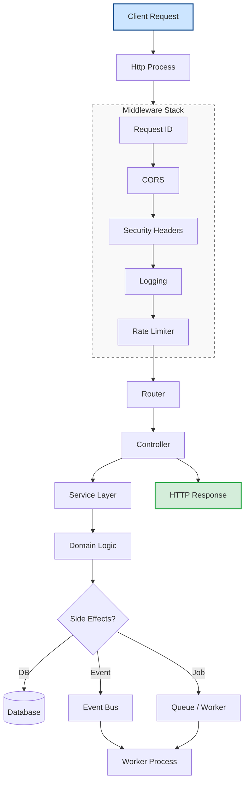
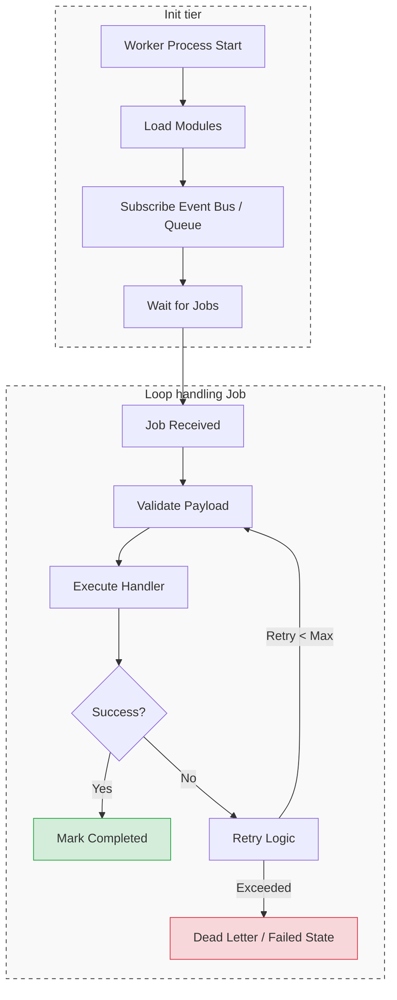
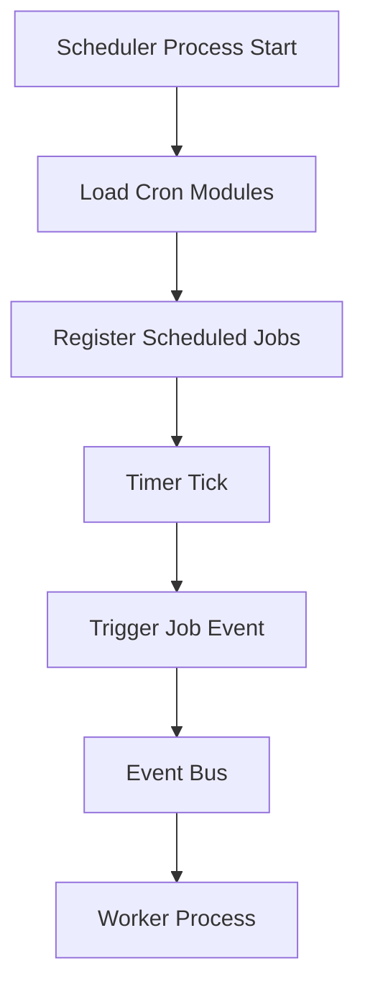

# Architecture — Under the Hood

For `PROCESS_TYPE` values, worker scaling config, and directory layout, see `docs/apply/architecture.md`.

## Application Lifecycle

```
index.ts
  └─ PROCESS_TYPE → HttpProcess | WorkerProcess | SchedulerProcess
        └─ BaseProcess
              1. _registerCoreDependencies()   ← DB, EventBus
              2. _initModules()                ← register() + onInit()
              3. bootstrap()                   ← start server / start consumer / start scheduler
              4. SIGTERM / SIGINT → cleanup()  ← graceful shutdown
```

Each process type is responsible for only one concern:

* Http → request handling
* Worker → job execution
* Scheduler → job triggering

See `docs/deeper/http.md`, `docs/deeper/worker.md`, `docs/deeper/scheduler.md` for each process's specific bootstrap/shutdown sequence.

## Module System

Each feature is encapsulated in a `Module` class:

```ts
class AuthModule extends Module {
  register()    // bind services into DI container
  bootstrap()   // start runtime logic (HTTP routes, consumers, etc.)
  onDestroy()   // cleanup resources
}
```

Modules declare dependencies via `getImportModules()`. The framework resolves them automatically using a hierarchical container model (parent → child containers). See `docs/deeper/modules.md` for the full lifecycle and cross-module access model, and `docs/deeper/archsafe.md` for how the module boundaries this section describes are actually enforced (not just documented).

## Dependency Injection

The system uses the `treasure-chest` DI container. Services are registered using symbol-based keys:

```ts
container.bind(AuthServiceKey).to(AuthService)
```

Each module has its own child container inheriting from the root container, enabling:

* Shared global services (DB, logger, event bus)
* Isolated module boundaries
* Cross-module resolution when needed

## Request Flow (API Process)

```
HTTP Request
  → Request ID middleware
  → CORS
  → Security headers
  → CSP
  → Logging
  → Rate limiting
  → Route handler
      → Validation middleware
      → Controller
          → Service layer
              → Domain logic / Job dispatch / Events
      → Response
  → Error handler (if exception occurs)
```

See `docs/deeper/middleware.md` for why this specific order was chosen.

## System Flow (End-to-End Architecture)

### Http Request Flow



> The `Event Bus → Worker Process` link is the intended end-state architecture. With the
> current `EVENT_BUS_TYPE=memory` transport, this link does not actually cross process
> boundaries yet — see `docs/deeper/worker.md`.

### Worker Execution Flow



> This diagram describes the intended shape of job execution (retry, dead-letter) once a real
> queue backend is wired in — the current `InMemoryEventBus` has no built-in retry/dead-letter
> mechanism of its own.

### Scheduler Flow



> In the current codebase, `SchedulerManager.register()` runs the job's `handler` directly (see
> `docs/apply/scheduler.md`) rather than publishing an event for a worker to pick up — the
> `Event Bus → Worker Process` hand-off shown here is the intended pattern for jobs that should
> do their actual work in the worker process, not something every scheduled job must do.

## Key Design Principles

* Process isolation: API / Worker / Scheduler are fully separated runtimes
* Event-driven architecture: business logic flows through events, not direct coupling
* Job-based background work: long-running tasks are handled outside API process
* Module encapsulation: each feature is self-contained
* Dependency injection: services are loosely coupled and testable
